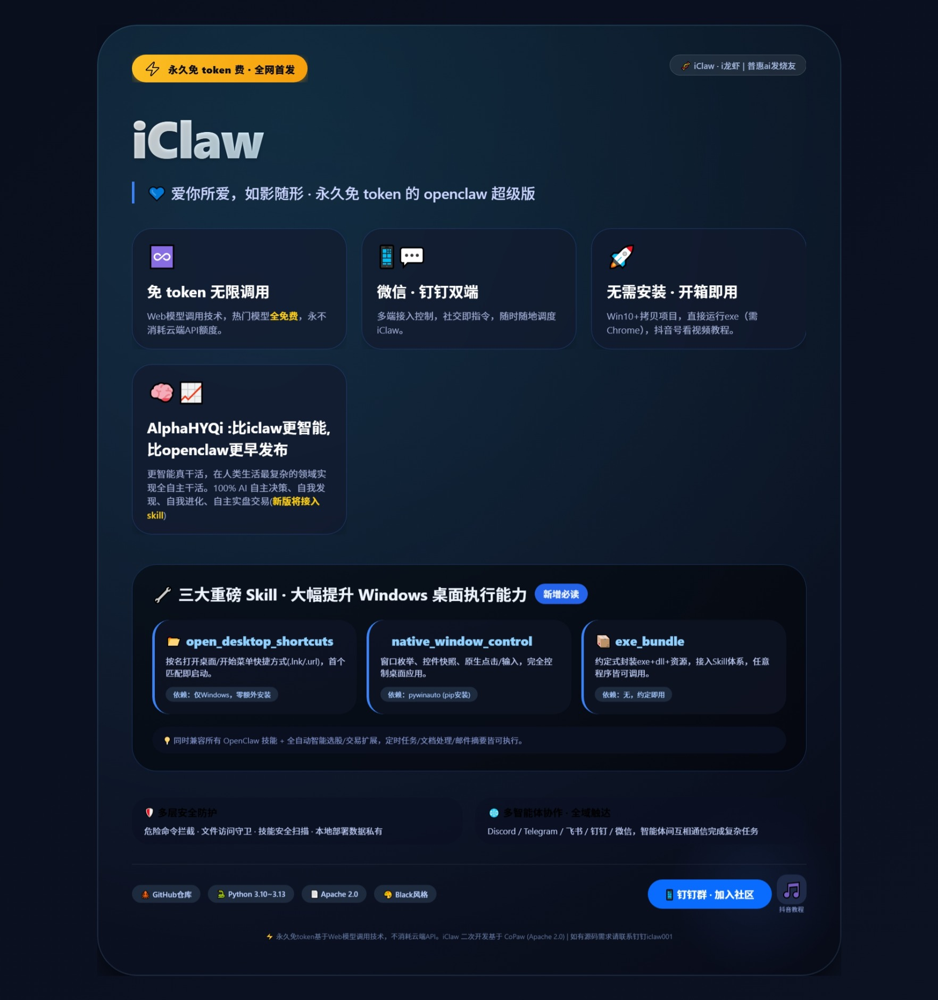

<div align="center">

# iClaw

[](https://github.com/hyqibot/token-free-openclaw)
[](https://www.python.org/downloads/)
[](LICENSE)
[](https://github.com/psf/black)
[](https://qr.dingtalk.com/action/joingroup?code=v1,k1,9O3Nk5uBqF+FKGHas0gK4dkuLhC1CkMJ4CgU45rKMf8=&_dt_no_comment=1&origin=11)

[[English](iClawREADME.md)] [[日本語](iClawREADME_ja.md)]


<p align="center"><b>爱你所爱，如影随形。</b></p>

</div>

永久免 token 费的 openclaw；三个重磅 Skill 大幅提升桌面执行能力；无需安装，开箱即用；支持微信、钉钉等多端接入控制。

### 宣传海报



同一版式的可编辑页面见 [`docs/iclaw宣传.html`](docs/iclaw宣传.html)（克隆仓库后，用本地浏览器打开该文件即可完整预览；在 GitHub 网页上点开 HTML 一般为源码视图）。

> **核心特色：**
>
> **永久免 token 费** — 通过 Web 模型调用技术，实现调用各大热门模型全免费（不消耗云端 API token）。
>
> **支持微信、钉钉** — 支持微信、钉钉等多端接入控制。
>
> **无需安装，开箱即用** — 鉴于多数ai项目部署复杂，本项目采取无需安装的模式，拷贝项目直接运行exe即可（win10以上系统，安装Chrome），提供官方参考视频，关注抖音号98806056998获取。
>
> **Skill 能力扩张** — 兼容所有 OpenClaw 技能，并提供更强的 Skill 扩展能力：例如全自动智能选股、智能交易等。
>
> **AlphaHYQi 支持（新版计划）** — AlphaHYQi比iclaw更智能,比openclaw更早发布，在人类生活最复杂的领域实现全自主干活。100% AI 自主决策、自我发现、自我进化、自主实盘交易。详情参见 [A-share-Ai](https://github.com/hyqibot/A-share-Ai/)。
>
> **桌面自由** — 目前 OpenClaw 桌面能力有所欠缺，部分桌面程序运行不了。我们新增了三个 Skill，可大幅提升 iClaw 对 Windows 桌面的操作能力（需按需导入技能池并启用）。
>

| Skill 名称 | 作用 | 依赖 |
|------------|------|------|
| **open_desktop_shortcuts** | 在用户/公共桌面、开始菜单 Programs 中**按名打开单个** `.lnk` / `.url`（首个匹配） | 仅 Windows；无额外安装 |
| **native_window_control** | 列举窗口、控件快照、点击/输入（原生桌面窗口） | Windows |
| **exe_bundle** | 约定如何将「exe + dll + 资源文件」接入为 skill | 无 |

### open_desktop_shortcuts

- **位置**（本仓库）：`src/copaw/agents/skills/open_desktop_shortcuts/SKILL.md`（OpenClaw 上游文档中常为 `skills/open_desktop_shortcuts/`）
- **使用**：用户说「打开某个快捷方式/链接」时，agent 根据 SKILL 用 PowerShell 在 **用户+公共桌面** 与 **用户+所有用户的开始菜单 Programs**（递归）中按 `$MATCH` 找 **第一个** 匹配项并启动；**不支持**本技能内「一次打开全部快捷方式」。
- **无需安装**：仅需 Windows 与可用的 shell/run 工具。
- **重要提示**：技能目录名 **不是** 可调用的工具函数；模型应使用已注册工具 **`execute_shell_command`**，在 `command` 中填入 SKILL 文档里的 PowerShell 单行（勿编造名为 `open_desktop_shortcuts` 的 tool 调用）。系统提示中已固定注入「技能 vs 已注册工具」说明。

### native_window_control

- **位置**：`skills/native_window_control/`（含 `SKILL.md`、`scripts/native_window.py`、`scripts/requirements.txt`）
- **依赖**：本机需安装 Python 且 `pip install pywinauto`（或 `pip install -r src/copaw/agents/skills/native_window_control/scripts/requirements.txt`）。
- **使用**：agent 根据 SKILL 在 shell 中执行本 skill 提供的 Python 脚本，例如：
  - 列举窗口：`python scripts/native_window.py list_windows`（工作目录为 skill 根或脚本所在目录）
  - 控件快照：`python scripts/native_window.py snapshot "窗口标题子串"`
  - 点击：`python scripts/native_window.py click "窗口标题" "ref"`
  - 输入：`python scripts/native_window.py type_text "窗口标题" "ref" "要输入的文字"`
- 脚本输出 JSON 到 stdout，供 agent 解析。

### exe_bundle

- **位置**（本仓库）：`src/copaw/agents/skills/exe_bundle/`（含 `SKILL.md`、`scripts/README.txt`）
- **使用**：作为**约定与模板**，说明如何把「exe + dll + 资源文件」放进某 skill 的 `scripts/<AppName>/`、如何写 cwd 与入口命令。agent 或用户在新建具体 exe 类 skill 时参考此 skill 的说明即可；无需单独“运行”exe_bundle。

#### 具体约定（用法）

##### 目录结构（示例）

在某个 skill（可以是专门为某软件建的 skill）里：

```text
scripts/MyApp/
  MyApp.exe
  （各种 dll、config、data 等）
```

##### 工作目录

执行时 **cwd** = `scripts/MyApp`（相对该 skill 根目录）。

##### 启动方式

在 shell 里：先 `cd` 到 `scripts/MyApp`，再执行 `MyApp.exe` 及参数，例如：

- 仅启动：`MyApp.exe`
- 带参数：`MyApp.exe --config config\app.json`

##### 新建「自己的 exe 类 skill」时

复制/参照 `exe_bundle` 的 `SKILL.md` 写法：在 `description` 里写清「用户说什么时触发」；正文里写清 cwd、入口命令、常用参数含义；把真实文件放进 `scripts/<应用名>/`。

##### 敏感信息

不要把密钥写进 SKILL；用环境变量或同目录配置文件，由程序自己读。

---

本项目在开源项目 **CoPaw** 基础上进行二次开发与定制（含性能与打包形态等）。

## 更多能力（来自上游 CoPaw）

- **Skills 扩展** — 内置定时任务、PDF/Office 处理、新闻摘要等；**Windows** 下可配合上文三个桌面相关 skill（需 `pip install pywinauto` 等）。自定义技能可导入技能池并挂载到智能体。
- **多智能体协作** — 创建多个独立智能体，各司其职；启用协作技能，智能体间互相通信共同完成复杂任务。
- **多层安全防护** — 工具防护、文件访问控制、技能安全扫描，保障运行安全。
- **全域触达** — 钉钉、飞书、微信、Discord、Telegram 等频道，按需连接。

<details>
<summary><b>你可以用 iClaw 做什么</b></summary>

- **社交媒体**：每日热帖摘要（小红书、知乎、Reddit），B 站/YouTube 新视频摘要。
- **生产力**：邮件与 Newsletter 精华推送到钉钉/飞书/QQ，邮件与日历整理联系人。
- **创意与构建**：睡前说明目标、自动执行，次日获得雏形；从选题到成片全流程。
- **研究与学习**：追踪科技与 AI 资讯，个人知识库检索复用。
- **桌面与文件**：整理与搜索本地文件、阅读与摘要文档，在会话中索要文件。
- **探索更多**：用 Skills 与定时任务组合成你自己的 agentic app。

</details>


## 安全特性

iClaw 内置多层安全防护机制，保障你的数据与系统安全：

- **工具防护** — 自动拦截危险 Shell 命令（如 `rm -rf /`、fork 炸弹、反向 shell 等）
- **文件访问守卫** — 限制智能体访问敏感路径（如 `~/.ssh`、密钥文件、系统目录等）
- **技能安全扫描** — 安装技能前自动扫描，检测提示词注入、命令注入、硬编码密钥、数据外泄等风险
- **本地部署** — 所有数据与记忆存储在本地，无第三方上传（使用云端 LLM API 时，对话内容会发送到对应的 API 提供商）


## 联系我们

**钉钉群**：[加入群聊](https://qr.dingtalk.com/action/joingroup?code=v1,k1,9O3Nk5uBqF+FKGHas0gK4dkuLhC1CkMJ4CgU45rKMf8=&_dt_no_comment=1&origin=11)

[](https://qr.dingtalk.com/action/joingroup?code=v1,k1,9O3Nk5uBqF+FKGHas0gK4dkuLhC1CkMJ4CgU45rKMf8=&_dt_no_comment=1&origin=11)

**抖音视频**：[抖音视频](https://uj22314052.jz.fkw.com/cn/view.jsp?fileID=ABUIABACGAAg6baTzwYo8Z_h8QQw5Qg42gg)

[](https://uj22314052.jz.fkw.com/cn/view.jsp?fileID=ABUIABACGAAg6baTzwYo8Z_h8QQw5Qg42gg)


## 许可证

[Apache License 2.0](LICENSE) 开源协议。

---

# 第三方开源软件声明

本产品 [iClaw] 版本 [1.0.0] 包含了以下由第三方开发并依据 **Apache License 2.0** 协议授权的开源软件。

## 使用的开源组件

### CoPaw
- **项目名称**: CoPaw
- **版权归属**: Copyright 2025 The CoPaw Authors，详见LICENSE文件
- **来源地址**: https://github.com/agentscope-ai/CoPaw
- **许可证**: Apache License 2.0
- **在本软件中的使用方式**: 修改后集成
- **修改说明**：对 skill 模块进行了功能扩展，新增免费 token 接入模块，支持以 exe 运行、免安装等形态。

## 许可证与免责声明

### Apache License 2.0 条款
本软件使用的上述开源组件遵循 Apache License 2.0 协议。您可以在以下位置获取协议完整副本：
- 本软件分发包中的 `LICENSE` 文件
- 或访问 https://www.apache.org/licenses/LICENSE-2.0

### 第三方代码免责声明
**针对上述列出的第三方开源组件（CoPaw）：**
这些组件由其原始著作权人按“原样”（AS-IS）提供，不附带任何明示或暗示的担保，包括但不限于对适销性、特定用途适用性及不侵权的担保。原始著作权人不对任何因使用这些组件而导致的损失承担责任。

### 我方代码的声明
本产品中除上述第三方组件外，其余代码由 [iClaw团队] 开发或修改。该部分代码按“原样”（AS-IS）提供，不附带任何明示或暗示的担保，包括但不限于对适销性、特定用途适用性及不侵权的担保。在任何情况下，[iClaw团队] 均不对因使用或无法使用该部分代码而导致的任何直接、间接、偶然、特殊或必然的损害（包括但不限于利润损失、数据丢失或业务中断）承担责任，即使已被告知可能发生此类损害。

## 如何获取完整源代码
本产品使用的开源组件及其修改版本（如有），其完整源代码可根据 Apache License 2.0 协议的要求获取。请联系：钉钉iclaw001。

## 致谢
感谢所有开源作者对开源社区的贡献。